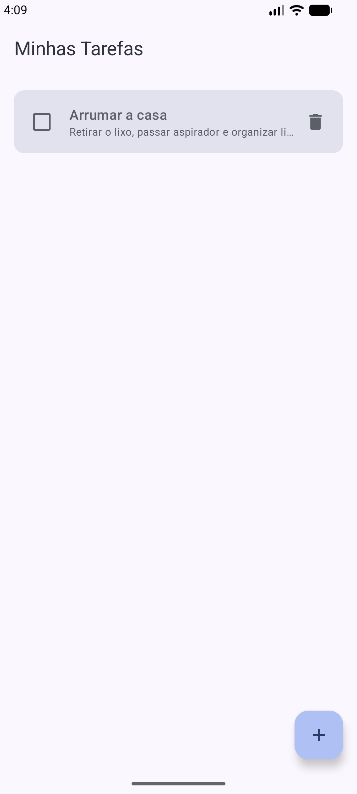
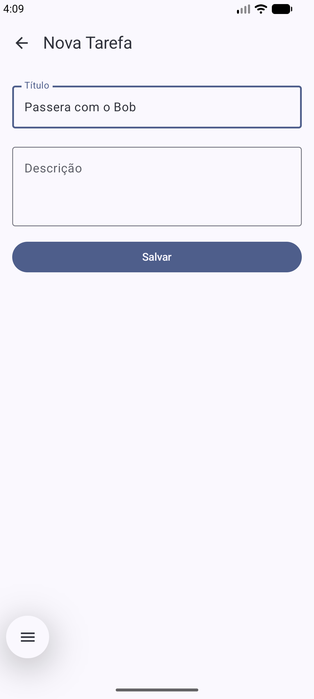
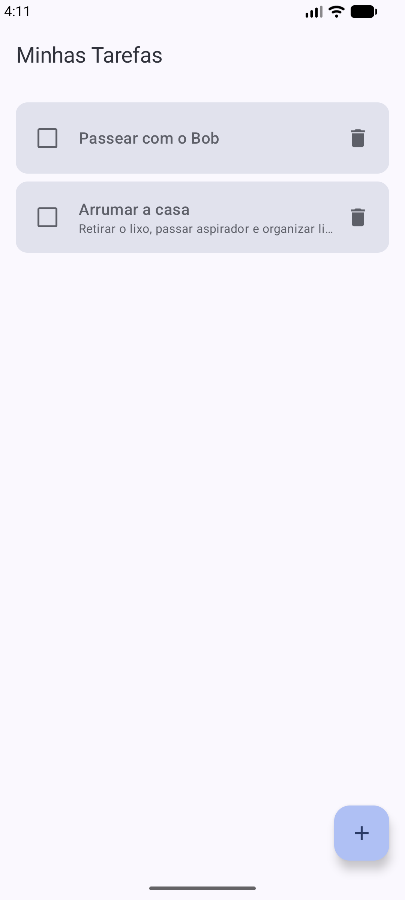
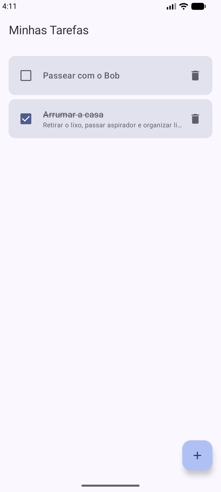
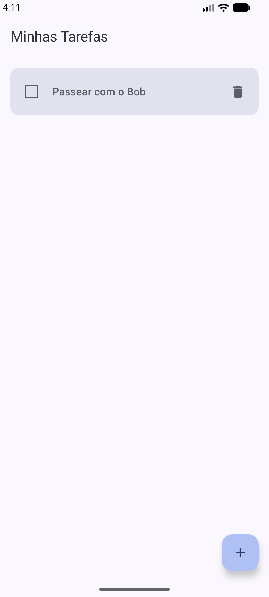
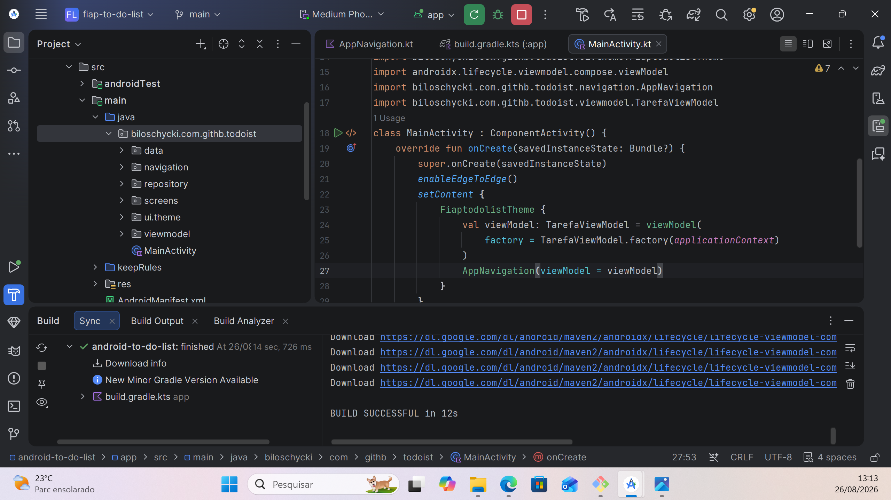

# FIAP To-Do List

Aplicativo Android de lista de tarefas (To-Do List) desenvolvido em **Kotlin** com **Jetpack Compose**, como projeto didático para praticar uma arquitetura MVVM completa com persistência local.

## Objetivo da aplicação

O app permite ao usuário gerenciar suas tarefas do dia a dia através de um CRUD completo:

- **C**riar uma nova tarefa, com título e descrição;
- **R**ecuperar/listar todas as tarefas cadastradas, ordenadas pela mais recente;
- **U**pdate/atualizar uma tarefa existente (edição de conteúdo ou marcação de "concluída");
- **D**eletar uma tarefa da lista.

Os dados são persistidos localmente no dispositivo com **Room**, então as tarefas continuam disponíveis mesmo depois de fechar o app.

## Tecnologias utilizadas

| Tecnologia | Papel no projeto |
|---|---|
| **Kotlin** | Linguagem principal da aplicação. |
| **Jetpack Compose** | Construção de toda a interface de forma declarativa (sem XML de layout). |
| **Room** | Persistência local dos dados em SQLite, com acesso via DAO. |
| **Coroutines / Flow** | Execução assíncrona das operações de banco e emissão reativa da lista de tarefas (`Flow` → `StateFlow`). |
| **ViewModel** | Guarda o estado da UI e sobrevive a mudanças de configuração (ex.: rotação de tela). |
| **Navigation Compose** | Gerencia a troca entre as telas (lista e formulário) e a passagem de parâmetros entre elas. |

## Arquitetura

O projeto segue o padrão **MVVM (Model-View-ViewModel) com Repository**, em que cada camada só conhece a camada imediatamente abaixo dela:

```
Compose UI (Screens)  →  ViewModel  →  Repository  →  DAO  →  Room Database
```

Estrutura de pacotes:

```
biloschycki.com.githb.todoist/
├── data/            → Entity, DAO e configuração do banco (Room)
├── repository/      → TarefaRepository (intermediário entre ViewModel e DAO)
├── viewmodel/        → TarefaViewModel (estado da UI + regras de acesso aos dados)
├── screens/          → ListaTarefasScreen e FormularioTarefaScreen (UI em Compose)
├── navigation/        → AppNavigation (rotas do app)
└── MainActivity.kt   → ponto de entrada do app
```

Essa separação em camadas facilita testes, manutenção e evita que a UI acesse o banco de dados diretamente.

### `TarefaRepository`

`TarefaRepository` é a camada que **abstrai a origem dos dados** para o resto do app. Ele recebe um `TarefaDao` por injeção via construtor e expõe uma API simples para quem precisa consumir ou alterar tarefas:

- `val tarefas: Flow<List<Tarefa>>` — expõe o `Flow` retornado pelo DAO, permitindo que quem observar receba automaticamente a lista atualizada sempre que o banco mudar;
- `suspend fun inserir(tarefa: Tarefa)` — insere uma nova tarefa;
- `suspend fun atualizar(tarefa: Tarefa)` — atualiza uma tarefa existente (usado tanto para editar título/descrição quanto para marcar como concluída);
- `suspend fun deletar(tarefa: Tarefa)` — remove uma tarefa.

O Repository não conhece a UI nem o ViewModel — ele apenas repassa as chamadas ao DAO. Isso significa que, se no futuro a fonte de dados mudasse (por exemplo, para uma API remota), apenas o Repository precisaria ser adaptado, sem impactar o ViewModel ou as telas.

### `TarefaViewModel`

`TarefaViewModel` é responsável por **manter e expor o estado da UI**, servindo de ponte entre as telas (Composables) e o `TarefaRepository`:

- Converte o `Flow` de tarefas do Repository em um `StateFlow` (`tarefas`), usando `stateIn` com `SharingStarted.WhileSubscribed(5_000)`. Isso mantém o Flow "quente" enquanto há observadores (mais os 5 segundos de tolerância para rotações de tela), evitando reprocessamento desnecessário;
- Expõe as funções `inserir`, `atualizar` e `deletar`, cada uma disparando uma coroutine em `viewModelScope.launch { ... }` para chamar o Repository de forma assíncrona, sem travar a thread principal;
- Sobrevive a mudanças de configuração (como rotação de tela), pois seu ciclo de vida é gerenciado pelo Android e é diferente do ciclo de vida da UI;
- Não conhece detalhes de Compose ou de navegação — só conhece o Repository e o estado que expõe.

A criação do ViewModel usa uma **Factory** (`TarefaViewModel.factory(context)`), já que o construtor exige um `TarefaRepository`, e o `ViewModelProvider` padrão do Android só sabe instanciar ViewModels sem argumentos.

### Como `ListaTarefasScreen` observa o estado e dispara ações

`ListaTarefasScreen` é a tela inicial do app e ilustra o padrão de observação de estado do Compose:

1. **Observação do estado:** ela coleta o `StateFlow<List<Tarefa>>` do ViewModel com `collectAsStateWithLifecycle()`, que entrega o valor mais atual da lista de tarefas e recompõe a tela automaticamente sempre que ele muda — sem a UI precisar pedir ou consultar nada manualmente.
2. **Disparo de ações:** a tela não altera o estado diretamente. Em vez disso, ela chama funções do ViewModel em resposta a interações do usuário:
   - marcar/desmarcar o `Checkbox` chama `viewModel.atualizar(tarefa.copy(concluida = ...))`;
   - tocar no ícone de lixeira chama `viewModel.deletar(tarefa)`;
   - tocar no card ou no botão flutuante (`FloatingActionButton`) aciona os callbacks `onEditarTarefa(id)` / `onNovaTarefa()`, que são repassados pela `AppNavigation` para navegar até o formulário.
3. A tela em si é dividida em um Composable "inteligente" (`ListaTarefasScreen`, que conhece o ViewModel) e um Composable "burro" (`ListaTarefasContent`, que só recebe dados e lambdas), o que facilita criar `@Preview`s isolados sem precisar de um ViewModel real.

### Como `FormularioTarefaScreen` diferencia cadastro e edição

A mesma tela é reaproveitada tanto para **criar** quanto para **editar** uma tarefa, usando o parâmetro `tarefaId: Int` recebido via navegação:

- Se `tarefaId == 0`, a tela está em modo **cadastro** (nova tarefa). Os campos começam vazios e, ao salvar, é chamado `viewModel.inserir(Tarefa(titulo = ..., descricao = ...))`.
- Se `tarefaId != 0`, a tela busca a tarefa correspondente dentro da lista observada do ViewModel (`tarefas.find { it.id == tarefaId }`) e a trata como **edição**. Os campos de texto são pré-preenchidos com `tituloInicial`/`descricaoInicial` vindos dessa tarefa e, ao salvar, é chamado `viewModel.atualizar(tarefaExistente.copy(titulo = ..., descricao = ...))`, preservando o `id` e o `concluida` originais.

O booleano `isEdicao = tarefaId != 0` também é usado para ajustar a UI — o título da `TopAppBar` muda entre **"Nova Tarefa"** e **"Editar Tarefa"** conforme o modo atual. Assim como na tela de lista, o formulário separa um Composable "inteligente" (`FormularioTarefaScreen`) de um "burro" (`FormularioTarefaContent`), que apenas recebe valores iniciais e lambdas — o que permite ter `@Preview`s tanto do modo cadastro quanto do modo edição.

### Rotas em `AppNavigation` e passagem do ID da tarefa

`AppNavigation` centraliza a navegação do app usando um `NavHost` com duas rotas:

- `"lista"` — rota inicial (`startDestination`), que renderiza `ListaTarefasScreen`;
- `"formulario/{tarefaId}"` — rota parametrizada, que renderiza `FormularioTarefaScreen`, recebendo o `tarefaId` como argumento de caminho (path argument).

A passagem do ID acontece assim:

1. Ao clicar em **"+"** (nova tarefa), a lista chama `navController.navigate("formulario/0")` — o `0` sinaliza "sem tarefa existente", ou seja, modo cadastro;
2. Ao clicar em uma tarefa existente, a lista chama `navController.navigate("formulario/$id")`, interpolando o ID real da tarefa na rota;
3. Dentro do `composable("formulario/{tarefaId}")`, o valor é recuperado do `backStackEntry.arguments` como `String` e convertido para `Int` (`?.toInt() ?: 0`), sendo então repassado como parâmetro `tarefaId` para `FormularioTarefaScreen`;
4. O botão de voltar do formulário (`onVoltar`) chama `navController.popBackStack()`, retornando para a tela de lista.

Esse esquema evita a necessidade de duas rotas separadas (uma para criar, outra para editar) — a mesma tela e a mesma rota atendem aos dois casos, diferenciando o comportamento apenas pelo valor do argumento.

### Como `MainActivity` cria a ViewModel e inicia a navegação

`MainActivity` é o ponto de entrada do app e tem responsabilidades bem enxutas:

1. No `onCreate`, chama `setContent { ... }` para definir a UI em Compose, envolvida pelo tema do app (`FiaptodolistTheme`);
2. Dentro do bloco de tema, instancia o `TarefaViewModel` usando a função `viewModel(factory = TarefaViewModel.factory(applicationContext))`. A `factory` é necessária porque `TarefaViewModel` recebe um `TarefaRepository` no construtor — e é essa factory que monta a cadeia completa `TarefaDatabase.getDatabase(context) → tarefaDao() → TarefaRepository(dao) → TarefaViewModel(repository)`;
3. Repassa essa única instância de ViewModel para `AppNavigation(viewModel = viewModel)`, que a distribui para as duas telas (`ListaTarefasScreen` e `FormularioTarefaScreen`). Isso garante que ambas as telas compartilhem o mesmo estado de tarefas, sem duplicar instâncias do ViewModel ou do banco de dados.

Em resumo, a `MainActivity` monta as dependências uma única vez e delega toda a navegação para `AppNavigation`, mantendo-se bem simples.

## Como executar o projeto

**Pré-requisitos:**
- Android Studio (versão recente, com suporte a Kotlin 2.x e Compose);
- SDK do Android instalado, incluindo a API 36 (compileSdk) — o app roda a partir do minSdk 24;
- JDK 11 ou superior.

**Passos:**

1. Clone ou baixe este repositório.
2. Abra a pasta `android-to-do-list` no Android Studio (`File > Open`).
3. Aguarde o Gradle sincronizar automaticamente as dependências (a primeira sincronização pode demorar alguns minutos para baixar as bibliotecas).
4. Conecte um dispositivo físico com depuração USB habilitada, ou inicie um emulador Android (AVD) pelo próprio Android Studio.
5. Clique em **Run ▶** (ou `Shift + F10`) para compilar e instalar o app.
6. O app abre diretamente na tela **"Minhas Tarefas"**, pronta para uso.

Também é possível visualizar cada tela isoladamente sem rodar o app, usando as funções `@Preview` já disponíveis em `ListaTarefasScreen.kt` e `FormularioTarefaScreen.kt` (aba **Design** ou **Split** do Android Studio).

## Evidências

As imagens abaixo foram capturadas durante a execução do app e comprovam o funcionamento do CRUD completo.

**1. Lista de tarefas com uma tarefa cadastrada**



**2. Cadastro de uma nova tarefa**



**3. Edição de uma tarefa existente**


**4. Lista atualizada após o cadastro (duas tarefas)**



**5. Tarefa marcada como concluída (checkbox e riscado no título)**



**6. Tarefa removida da lista após exclusão**



**7. Build do projeto executado com sucesso no Android Studio**


